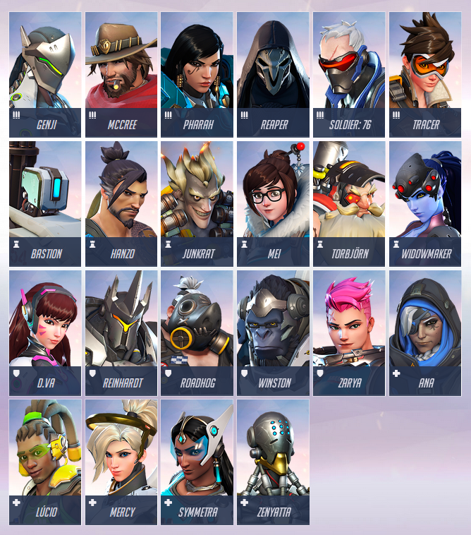

```{r setup, include=FALSE}
knitr::opts_chunk$set(echo = TRUE)

# Library used
library(dplyr)
library(ggplot2)

# Load data from URL
dat = tbl_df(read.csv('parse_tracker/overwatch.data.csv'))

hero_atk = c("Soldier: 76", "Genji", "Tracer", "McCree", "Pharah", "Reaper")
hero_def = c("Torbjörn", "Widowmaker", "Mei", "Junkrat", "Bastion", "Hanzo")
hero_tank = c("D.Va", "Reinhardt", "Roadhog", "Winston", "Zarya")
hero_heal = c("Ana", "Lúcio", "Mercy", "Symmetra", "Zenyatta")
```

# Introduction

## Summary
This report primarily concentrate on reviewing overwatch heroes and how they are/should be used.

## Overwatch Player Data Source
Player data is parsed from *https://overwatchtracker.com*. Player list is parsed on **August 4, 2016** and each player's competitive play data is parsed on **August 7, 2016**. Each player's data is dynamically loaded at runtime, hence prone to errors. Especially, there were zero-valued data where data cannot be zero, such as player level. Some data may have been manually deleted during parsing. Web crawler is developed with python3, and can be viewed at https://github.com/juice500ml/think_overwatch/tree/master/parse_tracker.

## Overwatch from *Wikipedia*
Overwatch is a **multiplayer first-person shooter** video game developed and published by Blizzard Entertainment. It was released in May 2016 for Microsoft Windows, PlayStation 4, and Xbox One.  
Overwatch puts players into **two teams of six**, with each player selecting one of several pre-defined hero characters with unique movement, attributes, and skills; these heroes are divided into four classes: **Offense, Defense, Tank, and Support**. Players on a team work together to secure and defend control points on a map and/or escort a payload across the map in a limited amount of time. The game was launched with casual play, while Blizzard added competitive ranked play about a month after launch. *Copied on August 15, 2016*

## Overwatch Heroes
  
*Image from https://playoverwatch.com/en-us/heroes/#all*  
*Copied on August 15, 2016*

### Hero Classes
There are 4 hero classes in Overwatch; each role sufficient for victory.  
*Role summary from http://overwatch.wikia.com/wiki/Role*  
*Copied on August 15, 2016*

### Offense
The main objective of the offense role is to scout the area, harass the opposing team, and press the objective. Heroes classified as offense generally have high damage weapons and abilities and lower health pools than tanks and some defense heroes. They are usually excellent duelists with high mobility and good burst or sustained damage. 
The following heroes have this role: McCree, Pharah, Reaper, Soldier: 76, Tracer and Genji. 

### Defense
The main objective of the defense role is to guard locations, create choke points, and establish a front. They may have long range weapons or the ability to create turrets, and excel at area denial.  
The following heroes have this role: Bastion, Hanzo, Junkrat, Torbjörn, Widowmaker and Mei. 

### Tank
The main objective of the defense role is to guard locations, create choke points, and establish a front. They may have long range weapons or the ability to create turrets, and excel at area denial.  
The following heroes have this role: Reinhardt, Roadhog, Winston, Zarya and D.Va.

### Support
The objective of support is to heal, buff and provide utility. Support heroes boost the overall performance of their team by increasing their survivability, speed, and damage output. They are generally the worst duelists and are best when surrounded by teammates.  
The following heroes have this role: Zenyatta, Mercy, Symmetra, Lúcio and Ana.

# Heroes Overview

## Overwatch Competitive Play Ratings
Ratings vary from 0 to near 90. If the player wins at competitive play, rating of the player goes up, and vice versa. It gets harder to increase rating when rating is higher, and easier when rating is lower. Tracked Players at *https://overwatchtracker.com* on August 7, 2016 were 47,267. And rating distribution as below.
```{r}
dat %>%
  ggplot(aes(x=RATING)) +
  ggtitle('Overwatch Rating Counts') +
  geom_histogram(bins=30)
  
qqnorm(dat$RATING)
qqline(dat$RATING)
```  

As we can more clearly see in the Q-Q plot, Overwatch rating closely follows normal distribution; presumably distributed manually by Blizzard itself.

## Game Matching of Overwatch
Game matching for competitive play can be shown in a roundabout way; by showing total kils per total deaths while playing competitive match. Note that total kills/deaths has the same ratio of average kills/deaths per game.
```{r}
set.seed(1608)
dat %>%
  sample_n(1000) %>%
  ggplot(aes(x=TOT_KILL, y=TOT_DEATH)) +
  geom_jitter() + 
  geom_smooth() +
  scale_x_log10() +
  scale_y_log10() +
  geom_abline() +
  ggtitle("Total Kills per Death")

cor(dat$TOT_KILL, dat$TOT_DEATH)
```
The bias betwen kills and deaths is primarily because Support heroes tends to die a lot, and not so many people play Support heroes.

## Most Popular Heroes (1st Pick)
1st Pick Heroes are chosen solely by player's total play time of the correspoding hero. Note that hero popularity can be biased as considerable amount of players tend to choose between multiple heroes, and this data ignored each player's playable spare heroes.

```{r}
dat %>%
  group_by(BEST_HERO) %>%
  mutate(count=n()) %>%
  ggplot(aes(x=reorder(BEST_HERO, count, y=count))) +
  ggtitle('Overwatch Heroes') +
  geom_bar() +
  coord_flip() +
  xlab("Hero Chosen") +
  ylab("Number of People")
```

### Offense Heroes
```{r}
dat %>%
  filter(BEST_HERO %in% hero_atk) %>%
  ggplot(aes(x=RATING, fill=BEST_HERO)) + 
  geom_density(position = "fill") +
  xlim(20, 80) +
  ggtitle("Offense Heroes 1st Pick")
```

Offense heroes are mainly chosen evenly, but Tracer is mostly chosen in the lowest tiers, but as ratings go up, McCree is the most chosen pick.

### Defence Heroes
```{r}
dat %>%
  filter(BEST_HERO %in% hero_def) %>%
  ggplot(aes(x=RATING, fill=BEST_HERO)) + 
  geom_density(position = "fill") +
  xlim(20, 80) +
  ggtitle("Defence Heroes 1st Pick")
```

Defence heroes are chosen evenly at the lower~middle tiers, but Torbjörn is mostly chosen in the lowest tiers, and gradually decreases. Also, Widowmaker takes nearly all the picks as rating goes up.

### Tank Heroes
```{r}
dat %>%
  filter(BEST_HERO %in% hero_tank) %>%
  ggplot(aes(x=RATING, fill=BEST_HERO)) + 
  geom_density(position = "fill") +
  xlim(20, 80) +
  ggtitle("Tank Heroes 1st Pick")
```

Tank heroes are chosen evenly at the middle tiers, but D.Va is mostly chosen in the lowest tiers, and Zarya takes other hero's picks as rating goes up.

### Support Heroes
```{r}
dat %>%
  filter(BEST_HERO %in% hero_heal) %>%
  ggplot(aes(x=RATING, fill=BEST_HERO)) + 
  geom_density(position = "fill") +
  xlim(20, 80) +
  ggtitle("Support Heroes 1st Pick")
```

Tank heroes are chosen very differently among tiers. Lúcio and Mercy is picked mostly at the lowest tier, and Symmetra has some share in the middle tier. But Ana and Zenyatta takes most of picks after rating 70.


### Classes
```{r}
dat %>%
  mutate(BEST_HERO_CLASS =
    ifelse(BEST_HERO %in% hero_atk, "Offense",
           ifelse(BEST_HERO %in% hero_def, "Defence",
                  ifelse(BEST_HERO %in% hero_tank, "Tank", "Support")))
  ) %>%
  ggplot(aes(x=RATING, fill=BEST_HERO_CLASS)) + 
  geom_density(position = "fill") +
  xlim(20, 80) +
  ggtitle("Heroes 1st Pick")
```

At the lower tiers, defence heroes are mostly chosen, but as rating goes up, offense heroes are more chosen. This could be because offense heroes are shown as more harder hero to play, but Support heroes are more easier.


## Most Appreciated Heroes
```{r}
dat %>%
  filter(BEST_HERO %in% hero_atk) %>%
  ggplot(aes(x=RATING, y=TOT_CARD / TOT_GAME, color=BEST_HERO)) +
  geom_point(alpha=0.1) +
  geom_line(method = "lm", formula = y ~ 0 + I(1/x) + I((x-1)/x), stat="smooth", size = 1, alpha = 1) +
  xlim(20, 80) +
  ylim(0, 1) +
  ggtitle("Which offense heroes get most cards?")
```
```{r}
dat %>%
  filter(BEST_HERO %in% hero_def) %>%
  ggplot(aes(x=RATING, y=TOT_CARD / TOT_GAME, color=BEST_HERO)) +
  geom_point(alpha=0.1) +
  geom_line(method = "lm", formula = y ~ 0 + I(1/x) + I((x-1)/x), stat="smooth", size = 1, alpha = 1) +
  xlim(20, 80) +
  ylim(0, 1) +
  ggtitle("Which defence heroes get most cards?")
```
```{r}
dat %>%
  filter(BEST_HERO %in% hero_tank) %>%
  ggplot(aes(x=RATING, y=TOT_CARD / TOT_GAME, color=BEST_HERO)) +
  geom_point(alpha=0.1) +
  geom_line(method = "lm", formula = y ~ 0 + I(1/x) + I((x-1)/x), stat="smooth", size = 1, alpha = 1) +
  xlim(20, 80) +
  ylim(0, 1) +
  ggtitle("Which tank heroes get most cards?")
```
```{r}
dat %>%
  filter(BEST_HERO %in% hero_heal) %>%
  ggplot(aes(x=RATING, y=TOT_CARD / TOT_GAME, color=BEST_HERO)) +
  geom_point(alpha=0.1) +
  geom_line(method = "lm", formula = y ~ 0 + I(1/x) + I((x-1)/x), stat="smooth", size = 1, alpha = 1) +
  xlim(20, 80) +
  ylim(0, 1) +
  ggtitle("Which support heroes get most cards?")
```
```{r}
dat %>%
  mutate(BEST_HERO_CLASS =
           ifelse(BEST_HERO %in% hero_atk, "Offense",
                  ifelse(BEST_HERO %in% hero_def, "Defence",
                         ifelse(BEST_HERO %in% hero_tank, "Tank", "Support")))
  ) %>%
  ggplot(aes(x=RATING, y=TOT_CARD / TOT_GAME, color=BEST_HERO_CLASS)) +
  geom_point(alpha=0.1) +
  geom_line(method = "lm", formula = y ~ 0 + I(1/x) + I((x-1)/x), stat="smooth", size = 1, alpha = 1) +
  xlim(20, 80) +
  ylim(0, 1) +
  ggtitle("Which hero classes get most cards?")
```


# Hero Analysis
Traits that can be calculated *per game* is chosen.  
Kills, Heals, Damages, Solo kills, Objective kills, Final blows, Environmental kills, Multiple kills, Deaths, Environmental deaths, Fire time, Objective time, Heal assistance, Defence assistance, Attack assistance.


## Offense

* Positive Traits
  * KILL_PER_GAME  
    Offensive heroes should deal fine amount of damage.
  * DMG_PER_GAME  
    Between Offensive heroes, Tracer, Genji and McCree's basic attack is not so strong or consistent as Solder:76, Pharah or Reaper. How to effectively use the basic attack decides for weak basic attack heroes.
  * AVG_FIRE_TIME  
    Offensive heroes should always be in *fire* mode, as kill streaks can easily achieve *fire* mode.
  * AVG_ASSIST / AVG_ATK_ASSIST / AVG_DEF_ASSIST  
    *Assist* of Overwatch cannot be earned by Offensive heroes; as this can be earned by only supporting teammates which is on the offensive or defensive. This should be earned by another heroes, such as Support heroes.
  * AVG_OBJ_TIME  
    Offense heroes *should* help objectives, not only getting kill streaks. Heroes should stay nearby objectives when at stable situation.
* Negative Traits
  * AVG_SOLO_KILL  
    Solo kills normally means hero has encountered one-to-one situation, and the hero got some blows from the opponent. Health packs are a rarity at the front line. Offense heroes should not push the front line too hard.
  * AVG_OBJ_KILL  
    When on attacked situation on the objective, Tank heroes should be the ones who guard the objective, not Offense heroes. Offense heroes should be at the back.
  * AVG_ENV_DEATH  
    Offensive heroes tends to be rapidly moving across maps. Accidental deaths by not understanding maps enough should be avoided.

### Genji
```{r}
hero = "Genji"
dat_each <- dat %>%
  filter(BEST_HERO == hero) %>%
    transmute(KILL_PER_GAME,
              HEAL_PER_GAME,
              DMG_PER_GAME,
              AVG_SOLO_KILL = TOT_SOLO_KILL / TOT_GAME,
              AVG_OBJ_KILL = TOT_OBJ_KILL / TOT_GAME,
              AVG_BLOW = TOT_BLOW / TOT_GAME,
              AVG_ENV_KILL = TOT_ENV_KILL / TOT_GAME,
              AVG_MUL_KILL = TOT_MUL_KILL / TOT_GAME,
              AVG_DEATH = TOT_DEATH / TOT_GAME,
              AVG_ENV_DEATH = TOT_ENV_DEATH / TOT_GAME,
              AVG_FIRE_TIME = TOT_FIRE_TIME / TOT_GAME,
              AVG_OBJ_TIME = TOT_OBJ_TIME / TOT_GAME,
              AVG_HEAL_ASSIST = TOT_HEAL_ASSIST / TOT_GAME,
              AVG_DEF_ASSIST = TOT_DEF_ASSIST / TOT_GAME,
              AVG_ATK_ASSIST = TOT_ATK_ASSIST / TOT_GAME,
              RATING)

hero_lm = lm(RATING ~ ., data = dat_each)
hero_lm %>%
  ggplot(aes(.fitted, .resid)) +
  geom_point() +
  stat_smooth(method="loess") +
  geom_hline(yintercept=0, col="red", linetype="dashed") +
  xlab("Fitted values") +
  ylab("Residuals") +
  ggtitle(paste("Residual vs Fitted Plot of Linear Model of Hero", hero, sep = " "))
print(summary(hero_lm))
```
* Positive Traits
  * KILL_PER_GAME
  * DMG_PER_GAME
  * AVG_FIRE_TIME
  * AVG_ATK_ASSIST
  * AVG_OBJ_TIME
* Negative Traits
  * AVG_SOLO_KILL
  * AVG_OBJ_KILL

### McCree
```{r, echo=FALSE}
hero = "McCree"
dat_each <- dat %>%
  filter(BEST_HERO == hero) %>%
    transmute(KILL_PER_GAME,
              HEAL_PER_GAME,
              DMG_PER_GAME,
              AVG_SOLO_KILL = TOT_SOLO_KILL / TOT_GAME,
              AVG_OBJ_KILL = TOT_OBJ_KILL / TOT_GAME,
              AVG_BLOW = TOT_BLOW / TOT_GAME,
              AVG_ENV_KILL = TOT_ENV_KILL / TOT_GAME,
              AVG_MUL_KILL = TOT_MUL_KILL / TOT_GAME,
              AVG_DEATH = TOT_DEATH / TOT_GAME,
              AVG_ENV_DEATH = TOT_ENV_DEATH / TOT_GAME,
              AVG_FIRE_TIME = TOT_FIRE_TIME / TOT_GAME,
              AVG_OBJ_TIME = TOT_OBJ_TIME / TOT_GAME,
              AVG_HEAL_ASSIST = TOT_HEAL_ASSIST / TOT_GAME,
              AVG_DEF_ASSIST = TOT_DEF_ASSIST / TOT_GAME,
              AVG_ATK_ASSIST = TOT_ATK_ASSIST / TOT_GAME,
              RATING)

hero_lm = lm(RATING ~ ., data = dat_each)
hero_lm %>%
  ggplot(aes(.fitted, .resid)) +
  geom_point() +
  stat_smooth(method="loess") +
  geom_hline(yintercept=0, col="red", linetype="dashed") +
  xlab("Fitted values") +
  ylab("Residuals") +
  ggtitle(paste("Residual vs Fitted Plot of Linear Model of Hero", hero, sep = " "))
print(summary(hero_lm))
```
* Positive Traits
  * KILL_PER_GAME
  * DMG_PER_GAME
  * AVG_FIRE_TIME
  * AVG_DEATH  
    Unusually, deaths raised the rating. From the fact that high rating players tend to use McCree often, and kills are more often at games played by high rankers, it can be deduced that this is the reason for high rate of average deaths.
* Negative Traits
  * AVG_SOLO_KILL
  * AVG_OBJ_KILL
  
### Pharah
```{r, echo=FALSE}
hero = "Pharah"
dat_each <- dat %>%
  filter(BEST_HERO == hero) %>%
    transmute(KILL_PER_GAME,
              HEAL_PER_GAME,
              DMG_PER_GAME,
              AVG_SOLO_KILL = TOT_SOLO_KILL / TOT_GAME,
              AVG_OBJ_KILL = TOT_OBJ_KILL / TOT_GAME,
              AVG_BLOW = TOT_BLOW / TOT_GAME,
              AVG_ENV_KILL = TOT_ENV_KILL / TOT_GAME,
              AVG_MUL_KILL = TOT_MUL_KILL / TOT_GAME,
              AVG_DEATH = TOT_DEATH / TOT_GAME,
              AVG_ENV_DEATH = TOT_ENV_DEATH / TOT_GAME,
              AVG_FIRE_TIME = TOT_FIRE_TIME / TOT_GAME,
              AVG_OBJ_TIME = TOT_OBJ_TIME / TOT_GAME,
              AVG_HEAL_ASSIST = TOT_HEAL_ASSIST / TOT_GAME,
              AVG_DEF_ASSIST = TOT_DEF_ASSIST / TOT_GAME,
              AVG_ATK_ASSIST = TOT_ATK_ASSIST / TOT_GAME,
              RATING)

hero_lm = lm(RATING ~ ., data = dat_each)
hero_lm %>%
  ggplot(aes(.fitted, .resid)) +
  geom_point() +
  stat_smooth(method="loess") +
  geom_hline(yintercept=0, col="red", linetype="dashed") +
  xlab("Fitted values") +
  ylab("Residuals") +
  ggtitle(paste("Residual vs Fitted Plot of Linear Model of Hero", hero, sep = " "))
print(summary(hero_lm))
```
* Positive Traits
  * KILL_PER_GAME
  * AVG_MUL_KILL  
    Hero speciality of Pharah can kill multiple enemies at one time. Effective usage of this skill is required for Pharah gameplay.
  * AVG_OBJ_TIME
  * AVG_DEF_ASSIST
  * AVG_ATK_ASSIST
* Negative Traits
  * AVG_SOLO_KILL
  * AVG_OBJ_KILL  
    Pharah has a relatively small value compared to other offense heroes. This is because Pharah has most powerful and hard-to-sight single blow between offensive heroes.
  * AVG_ENV_DEATH

### Reaper
```{r, echo=FALSE}
hero = "Reaper"
dat_each <- dat %>%
  filter(BEST_HERO == hero) %>%
    transmute(KILL_PER_GAME,
              HEAL_PER_GAME,
              DMG_PER_GAME,
              AVG_SOLO_KILL = TOT_SOLO_KILL / TOT_GAME,
              AVG_OBJ_KILL = TOT_OBJ_KILL / TOT_GAME,
              AVG_BLOW = TOT_BLOW / TOT_GAME,
              AVG_ENV_KILL = TOT_ENV_KILL / TOT_GAME,
              AVG_MUL_KILL = TOT_MUL_KILL / TOT_GAME,
              AVG_DEATH = TOT_DEATH / TOT_GAME,
              AVG_ENV_DEATH = TOT_ENV_DEATH / TOT_GAME,
              AVG_FIRE_TIME = TOT_FIRE_TIME / TOT_GAME,
              AVG_OBJ_TIME = TOT_OBJ_TIME / TOT_GAME,
              AVG_HEAL_ASSIST = TOT_HEAL_ASSIST / TOT_GAME,
              AVG_DEF_ASSIST = TOT_DEF_ASSIST / TOT_GAME,
              AVG_ATK_ASSIST = TOT_ATK_ASSIST / TOT_GAME,
              RATING)

hero_lm = lm(RATING ~ ., data = dat_each)
hero_lm %>%
  ggplot(aes(.fitted, .resid)) +
  geom_point() +
  stat_smooth(method="loess") +
  geom_hline(yintercept=0, col="red", linetype="dashed") +
  xlab("Fitted values") +
  ylab("Residuals") +
  ggtitle(paste("Residual vs Fitted Plot of Linear Model of Hero", hero, sep = " "))
print(summary(hero_lm))
```
* Positive Traits
  * KILL_PER_GAME
  * AVG_FIRE_TIME
  * AVG_ATK_ASSIST
  * AVG_OBJ_TIME
* Negative Traits
  * AVG_SOLO_KILL
  * AVG_OBJ_KILL
  * AVG_ENV_DEATH
  
### Soldier: 76
```{r, echo=FALSE}
hero = "Soldier: 76"
dat_each <- dat %>%
  filter(BEST_HERO == hero) %>%
    transmute(KILL_PER_GAME,
              HEAL_PER_GAME,
              DMG_PER_GAME,
              AVG_SOLO_KILL = TOT_SOLO_KILL / TOT_GAME,
              AVG_OBJ_KILL = TOT_OBJ_KILL / TOT_GAME,
              AVG_BLOW = TOT_BLOW / TOT_GAME,
              AVG_ENV_KILL = TOT_ENV_KILL / TOT_GAME,
              AVG_MUL_KILL = TOT_MUL_KILL / TOT_GAME,
              AVG_DEATH = TOT_DEATH / TOT_GAME,
              AVG_ENV_DEATH = TOT_ENV_DEATH / TOT_GAME,
              AVG_FIRE_TIME = TOT_FIRE_TIME / TOT_GAME,
              AVG_OBJ_TIME = TOT_OBJ_TIME / TOT_GAME,
              AVG_HEAL_ASSIST = TOT_HEAL_ASSIST / TOT_GAME,
              AVG_DEF_ASSIST = TOT_DEF_ASSIST / TOT_GAME,
              AVG_ATK_ASSIST = TOT_ATK_ASSIST / TOT_GAME,
              RATING)

hero_lm = lm(RATING ~ ., data = dat_each)
hero_lm %>%
  ggplot(aes(.fitted, .resid)) +
  geom_point() +
  stat_smooth(method="loess") +
  geom_hline(yintercept=0, col="red", linetype="dashed") +
  xlab("Fitted values") +
  ylab("Residuals") +
  ggtitle(paste("Residual vs Fitted Plot of Linear Model of Hero", hero, sep = " "))
print(summary(hero_lm))
```
* Positive Traits
  * KILL_PER_GAME
  * AVG_FIRE_TIME
  * AVG_ATK_ASSIST
  * AVG_DEF_ASSIST
  * AVG_OBJ_TIME
* Negative Traits
  * AVG_SOLO_KILL
  * AVG_OBJ_KILL
  * AVG_ENV_DEATH

### Tracer
```{r, echo=FALSE}
hero = "Tracer"
dat_each <- dat %>%
  filter(BEST_HERO == hero) %>%
    transmute(KILL_PER_GAME,
              HEAL_PER_GAME,
              DMG_PER_GAME,
              AVG_SOLO_KILL = TOT_SOLO_KILL / TOT_GAME,
              AVG_OBJ_KILL = TOT_OBJ_KILL / TOT_GAME,
              AVG_BLOW = TOT_BLOW / TOT_GAME,
              AVG_ENV_KILL = TOT_ENV_KILL / TOT_GAME,
              AVG_MUL_KILL = TOT_MUL_KILL / TOT_GAME,
              AVG_DEATH = TOT_DEATH / TOT_GAME,
              AVG_ENV_DEATH = TOT_ENV_DEATH / TOT_GAME,
              AVG_FIRE_TIME = TOT_FIRE_TIME / TOT_GAME,
              AVG_OBJ_TIME = TOT_OBJ_TIME / TOT_GAME,
              AVG_HEAL_ASSIST = TOT_HEAL_ASSIST / TOT_GAME,
              AVG_DEF_ASSIST = TOT_DEF_ASSIST / TOT_GAME,
              AVG_ATK_ASSIST = TOT_ATK_ASSIST / TOT_GAME,
              RATING)

hero_lm = lm(RATING ~ ., data = dat_each)
hero_lm %>%
  ggplot(aes(.fitted, .resid)) +
  geom_point() +
  stat_smooth(method="loess") +
  geom_hline(yintercept=0, col="red", linetype="dashed") +
  xlab("Fitted values") +
  ylab("Residuals") +
  ggtitle(paste("Residual vs Fitted Plot of Linear Model of Hero", hero, sep = " "))
print(summary(hero_lm))
```
* Positive Traits
  * KILL_PER_GAME
  * AVG_FIRE_TIME
  * AVG_ATK_ASSIST
  * AVG_DEF_ASSIST
  * AVG_OBJ_TIME
* Negative Traits
  * AVG_SOLO_KILL
  * AVG_OBJ_KILL
  * AVG_ENV_DEATH

## Defence

* Positive Traits
  * AVG_OBJ_TIME  
    Defence heroes should stay with tank and support heroes, or stay near for them, as they are direct line of offence for support heroes.
  * AVG_ASSIST / AVG_ATK_ASSIST / AVG_DEF_ASSIST  
    *Assist* of Overwatch cannot be earned by Defensive heroes; as this can be earned by only supporting teammates which is on the offensive or defensive. This should be earned by another heroes, such as Support heroes.
* Negative Traits  
  * AVG_SOLO_KILL  
    It is similar with offense heroes, but much more. Defensive heroes have much less dealing capacity than offense heroes.
  * AVG_OBJ_KILL
    It is similar with offense heroes.
  * AVG_DEATH  
    This shows the importance of quick battle-joining for defence, as defence heroes primarily keep tank and support heroes more safe by dealing.
    

### Bastion
```{r, echo=FALSE}
hero = "Bastion"
dat_each <- dat %>%
  filter(BEST_HERO == hero) %>%
    transmute(KILL_PER_GAME,
              HEAL_PER_GAME,
              DMG_PER_GAME,
              AVG_SOLO_KILL = TOT_SOLO_KILL / TOT_GAME,
              AVG_OBJ_KILL = TOT_OBJ_KILL / TOT_GAME,
              AVG_BLOW = TOT_BLOW / TOT_GAME,
              AVG_ENV_KILL = TOT_ENV_KILL / TOT_GAME,
              AVG_MUL_KILL = TOT_MUL_KILL / TOT_GAME,
              AVG_DEATH = TOT_DEATH / TOT_GAME,
              AVG_ENV_DEATH = TOT_ENV_DEATH / TOT_GAME,
              AVG_FIRE_TIME = TOT_FIRE_TIME / TOT_GAME,
              AVG_OBJ_TIME = TOT_OBJ_TIME / TOT_GAME,
              AVG_HEAL_ASSIST = TOT_HEAL_ASSIST / TOT_GAME,
              AVG_DEF_ASSIST = TOT_DEF_ASSIST / TOT_GAME,
              AVG_ATK_ASSIST = TOT_ATK_ASSIST / TOT_GAME,
              RATING)

hero_lm = lm(RATING ~ ., data = dat_each)
hero_lm %>%
  ggplot(aes(.fitted, .resid)) +
  geom_point() +
  stat_smooth(method="loess") +
  geom_hline(yintercept=0, col="red", linetype="dashed") +
  xlab("Fitted values") +
  ylab("Residuals") +
  ggtitle(paste("Residual vs Fitted Plot of Linear Model of Hero", hero, sep = " "))
print(summary(hero_lm))
```
* Positive Traits
  * KILL_PER_GAME  
    Bastion should not be inside objectives, but stationed in unsuspectible places, for kills. Bastion has consistent and strong basic attack.
* Negative Traits
  * AVG_SOLO_KILL
  * AVG_DEATH  
    Much more bigger negative handicap of AVG_DEATH indirectly shows the importance of quick battle-joining. Bastion has a very slow speed of joining, so its handicap is much bigger.

### Hanzo
```{r, echo=FALSE}
hero = "Hanzo"
dat_each <- dat %>%
  filter(BEST_HERO == hero) %>%
    transmute(KILL_PER_GAME,
              HEAL_PER_GAME,
              DMG_PER_GAME,
              AVG_SOLO_KILL = TOT_SOLO_KILL / TOT_GAME,
              AVG_OBJ_KILL = TOT_OBJ_KILL / TOT_GAME,
              AVG_BLOW = TOT_BLOW / TOT_GAME,
              AVG_ENV_KILL = TOT_ENV_KILL / TOT_GAME,
              AVG_MUL_KILL = TOT_MUL_KILL / TOT_GAME,
              AVG_DEATH = TOT_DEATH / TOT_GAME,
              AVG_ENV_DEATH = TOT_ENV_DEATH / TOT_GAME,
              AVG_FIRE_TIME = TOT_FIRE_TIME / TOT_GAME,
              AVG_OBJ_TIME = TOT_OBJ_TIME / TOT_GAME,
              AVG_HEAL_ASSIST = TOT_HEAL_ASSIST / TOT_GAME,
              AVG_DEF_ASSIST = TOT_DEF_ASSIST / TOT_GAME,
              AVG_ATK_ASSIST = TOT_ATK_ASSIST / TOT_GAME,
              RATING)

hero_lm = lm(RATING ~ ., data = dat_each)
hero_lm %>%
  ggplot(aes(.fitted, .resid)) +
  geom_point() +
  stat_smooth(method="loess") +
  geom_hline(yintercept=0, col="red", linetype="dashed") +
  xlab("Fitted values") +
  ylab("Residuals") +
  ggtitle(paste("Residual vs Fitted Plot of Linear Model of Hero", hero, sep = " "))
print(summary(hero_lm))
```
* Positive Traits
  * KILL_PER_GAME  
  * AVG_OBJ_TIME  
    Hanzo should stay in objective, clearing out far enemies before coming too close. Hanzo's Sonic Arrow can help this.
  * AVG_DEF_ASSIST
* Negative Traits
  * AVG_SOLO_KILL
  * AVG_OBJ_KILL
  * AVG_DEATH

### Junkrat
```{r, echo=FALSE}
hero = "Junkrat"
dat_each <- dat %>%
  filter(BEST_HERO == hero) %>%
    transmute(KILL_PER_GAME,
              HEAL_PER_GAME,
              DMG_PER_GAME,
              AVG_SOLO_KILL = TOT_SOLO_KILL / TOT_GAME,
              AVG_OBJ_KILL = TOT_OBJ_KILL / TOT_GAME,
              AVG_BLOW = TOT_BLOW / TOT_GAME,
              AVG_ENV_KILL = TOT_ENV_KILL / TOT_GAME,
              AVG_MUL_KILL = TOT_MUL_KILL / TOT_GAME,
              AVG_DEATH = TOT_DEATH / TOT_GAME,
              AVG_ENV_DEATH = TOT_ENV_DEATH / TOT_GAME,
              AVG_FIRE_TIME = TOT_FIRE_TIME / TOT_GAME,
              AVG_OBJ_TIME = TOT_OBJ_TIME / TOT_GAME,
              AVG_HEAL_ASSIST = TOT_HEAL_ASSIST / TOT_GAME,
              AVG_DEF_ASSIST = TOT_DEF_ASSIST / TOT_GAME,
              AVG_ATK_ASSIST = TOT_ATK_ASSIST / TOT_GAME,
              RATING)

hero_lm = lm(RATING ~ ., data = dat_each)
hero_lm %>%
  ggplot(aes(.fitted, .resid)) +
  geom_point() +
  stat_smooth(method="loess") +
  geom_hline(yintercept=0, col="red", linetype="dashed") +
  xlab("Fitted values") +
  ylab("Residuals") +
  ggtitle(paste("Residual vs Fitted Plot of Linear Model of Hero", hero, sep = " "))
print(summary(hero_lm))
```
* Positive Traits
  * KILL_PER_GAME
  * DMG_PER_GAME
  * AVG_FIRE_TIME
    Junkrat is one of the dealers within defence heroes, so it behaves similar with offense heroes.
  * AVG_OBJ_TIME
  * AVG_ATK_ASSIST
  * AVG_DEF_ASSIST
* Negative Traits
  * AVG_SOLO_KILL
  * AVG_OBJ_KILL
  * AVG_DEATH
    Junkrat's slow movement speed makes negative handicap of AVG_DEATH, similar to Bastion.
  * AVG_ENV_DEATH
    But this means that Junkrat has to understand map very throughly, so handicap for environmental deaths exists for Junkrat.

### Mei
```{r, echo=FALSE}
hero = "Mei"
dat_each <- dat %>%
  filter(BEST_HERO == hero) %>%
    transmute(KILL_PER_GAME,
              HEAL_PER_GAME,
              DMG_PER_GAME,
              AVG_SOLO_KILL = TOT_SOLO_KILL / TOT_GAME,
              AVG_OBJ_KILL = TOT_OBJ_KILL / TOT_GAME,
              AVG_BLOW = TOT_BLOW / TOT_GAME,
              AVG_ENV_KILL = TOT_ENV_KILL / TOT_GAME,
              AVG_MUL_KILL = TOT_MUL_KILL / TOT_GAME,
              AVG_DEATH = TOT_DEATH / TOT_GAME,
              AVG_ENV_DEATH = TOT_ENV_DEATH / TOT_GAME,
              AVG_FIRE_TIME = TOT_FIRE_TIME / TOT_GAME,
              AVG_OBJ_TIME = TOT_OBJ_TIME / TOT_GAME,
              AVG_HEAL_ASSIST = TOT_HEAL_ASSIST / TOT_GAME,
              AVG_DEF_ASSIST = TOT_DEF_ASSIST / TOT_GAME,
              AVG_ATK_ASSIST = TOT_ATK_ASSIST / TOT_GAME,
              RATING)

hero_lm = lm(RATING ~ ., data = dat_each)
hero_lm %>%
  ggplot(aes(.fitted, .resid)) +
  geom_point() +
  stat_smooth(method="loess") +
  geom_hline(yintercept=0, col="red", linetype="dashed") +
  xlab("Fitted values") +
  ylab("Residuals") +
  ggtitle(paste("Residual vs Fitted Plot of Linear Model of Hero", hero, sep = " "))
print(summary(hero_lm))
```
* Positive Traits
  * KILL_PER_GAME
  * AVG_OBJ_TIME
  * AVG_ATK_ASSIST
* Negative Traits
  * AVG_SOLO_KILL
  * AVG_OBJ_KILL

### Torbjörn
```{r, echo=FALSE}
hero = "Torbjörn"
dat_each <- dat %>%
  filter(BEST_HERO == hero) %>%
    transmute(KILL_PER_GAME,
              HEAL_PER_GAME,
              DMG_PER_GAME,
              AVG_SOLO_KILL = TOT_SOLO_KILL / TOT_GAME,
              AVG_OBJ_KILL = TOT_OBJ_KILL / TOT_GAME,
              AVG_BLOW = TOT_BLOW / TOT_GAME,
              AVG_ENV_KILL = TOT_ENV_KILL / TOT_GAME,
              AVG_MUL_KILL = TOT_MUL_KILL / TOT_GAME,
              AVG_DEATH = TOT_DEATH / TOT_GAME,
              AVG_ENV_DEATH = TOT_ENV_DEATH / TOT_GAME,
              AVG_FIRE_TIME = TOT_FIRE_TIME / TOT_GAME,
              AVG_OBJ_TIME = TOT_OBJ_TIME / TOT_GAME,
              AVG_HEAL_ASSIST = TOT_HEAL_ASSIST / TOT_GAME,
              AVG_DEF_ASSIST = TOT_DEF_ASSIST / TOT_GAME,
              AVG_ATK_ASSIST = TOT_ATK_ASSIST / TOT_GAME,
              RATING)

hero_lm = lm(RATING ~ ., data = dat_each)
hero_lm %>%
  ggplot(aes(.fitted, .resid)) +
  geom_point() +
  stat_smooth(method="loess") +
  geom_hline(yintercept=0, col="red", linetype="dashed") +
  xlab("Fitted values") +
  ylab("Residuals") +
  ggtitle(paste("Residual vs Fitted Plot of Linear Model of Hero", hero, sep = " "))
print(summary(hero_lm))
```
* Positive Traits
  * AVG_BLOW  
    Many players forget that Torbjörn has a very powerful shotgun as a basic attack. It is great for making final blows in short distance. 
  * AVG_FIRE_TIME
* Negative Traits
  * AVG_SOLO_KILL

### Widowmaker
```{r, echo=FALSE}
hero = "Widowmaker"
dat_each <- dat %>%
  filter(BEST_HERO == hero) %>%
    transmute(KILL_PER_GAME,
              HEAL_PER_GAME,
              DMG_PER_GAME,
              AVG_SOLO_KILL = TOT_SOLO_KILL / TOT_GAME,
              AVG_OBJ_KILL = TOT_OBJ_KILL / TOT_GAME,
              AVG_BLOW = TOT_BLOW / TOT_GAME,
              AVG_ENV_KILL = TOT_ENV_KILL / TOT_GAME,
              AVG_MUL_KILL = TOT_MUL_KILL / TOT_GAME,
              AVG_DEATH = TOT_DEATH / TOT_GAME,
              AVG_ENV_DEATH = TOT_ENV_DEATH / TOT_GAME,
              AVG_FIRE_TIME = TOT_FIRE_TIME / TOT_GAME,
              AVG_OBJ_TIME = TOT_OBJ_TIME / TOT_GAME,
              AVG_HEAL_ASSIST = TOT_HEAL_ASSIST / TOT_GAME,
              AVG_DEF_ASSIST = TOT_DEF_ASSIST / TOT_GAME,
              AVG_ATK_ASSIST = TOT_ATK_ASSIST / TOT_GAME,
              RATING)

hero_lm = lm(RATING ~ ., data = dat_each)
hero_lm %>%
  ggplot(aes(.fitted, .resid)) +
  geom_point() +
  stat_smooth(method="loess") +
  geom_hline(yintercept=0, col="red", linetype="dashed") +
  xlab("Fitted values") +
  ylab("Residuals") +
  ggtitle(paste("Residual vs Fitted Plot of Linear Model of Hero", hero, sep = " "))
print(summary(hero_lm))
```
* Positive Traits
  * KILL_PER_GAME
* Negative Traits
  * AVG_SOLO_KILL
  * AVG_OBJ_KIL


## Tank

* Positive Traits
  * KILL_PER_GAME
  * AVG_FIRE_TIME  
    Tank heroes can achieve fire time easily by objectives.
  * AVG_OBJ_TIME  
    Tank heroes should stay and keep objectives safe.
  * AVG_DEF_ASSIST / AVG_ATK_ASSIST  
    Tank heroes should use their skillset for other's good, such as D.Va's defensive matrix and Zarya's Particle Barrier.
* Negative Traits
  * AVG_SOLO_KILL  
    Similar rules apply to Tank heroes. When Tank heores have to make their kills solo, the team itself have some problems.
  * AVG_OBJ_KILL

### D.Va
```{r, echo=FALSE}
hero = "D.Va"
dat_each <- dat %>%
  filter(BEST_HERO == hero) %>%
    transmute(KILL_PER_GAME,
              HEAL_PER_GAME,
              DMG_PER_GAME,
              AVG_SOLO_KILL = TOT_SOLO_KILL / TOT_GAME,
              AVG_OBJ_KILL = TOT_OBJ_KILL / TOT_GAME,
              AVG_BLOW = TOT_BLOW / TOT_GAME,
              AVG_ENV_KILL = TOT_ENV_KILL / TOT_GAME,
              AVG_MUL_KILL = TOT_MUL_KILL / TOT_GAME,
              AVG_DEATH = TOT_DEATH / TOT_GAME,
              AVG_ENV_DEATH = TOT_ENV_DEATH / TOT_GAME,
              AVG_FIRE_TIME = TOT_FIRE_TIME / TOT_GAME,
              AVG_OBJ_TIME = TOT_OBJ_TIME / TOT_GAME,
              AVG_HEAL_ASSIST = TOT_HEAL_ASSIST / TOT_GAME,
              AVG_DEF_ASSIST = TOT_DEF_ASSIST / TOT_GAME,
              AVG_ATK_ASSIST = TOT_ATK_ASSIST / TOT_GAME,
              RATING)

hero_lm = lm(RATING ~ ., data = dat_each)
hero_lm %>%
  ggplot(aes(.fitted, .resid)) +
  geom_point() +
  stat_smooth(method="loess") +
  geom_hline(yintercept=0, col="red", linetype="dashed") +
  xlab("Fitted values") +
  ylab("Residuals") +
  ggtitle(paste("Residual vs Fitted Plot of Linear Model of Hero", hero, sep = " "))
print(summary(hero_lm))
```
* Positive Traits
  * KILL_PER_GAME
  * AVG_BLOW  
    D.Va's Self-Destruct deals with substantial amount of damage. Positive feedback of average death blows means usage of the skillset is important.
  * AVG_ENV_KILL
    D.Va can also knock off enemies using Boosters. This requires extensive amount of knowledge on playing maps. D.Va players should understand map characteristics and use them for crowd control & kills.
  * AVG_FIRE_TIME
  * AVG_ATK_ASSIST
  
* Negative Traits
  * AVG_SOLO_KILL
  * AVG_OBJ_KILL

### Reinhardt
```{r, echo=FALSE}
hero = "Reinhardt"
dat_each <- dat %>%
  filter(BEST_HERO == hero) %>%
    transmute(KILL_PER_GAME,
              HEAL_PER_GAME,
              DMG_PER_GAME,
              AVG_SOLO_KILL = TOT_SOLO_KILL / TOT_GAME,
              AVG_OBJ_KILL = TOT_OBJ_KILL / TOT_GAME,
              AVG_BLOW = TOT_BLOW / TOT_GAME,
              AVG_ENV_KILL = TOT_ENV_KILL / TOT_GAME,
              AVG_MUL_KILL = TOT_MUL_KILL / TOT_GAME,
              AVG_DEATH = TOT_DEATH / TOT_GAME,
              AVG_ENV_DEATH = TOT_ENV_DEATH / TOT_GAME,
              AVG_FIRE_TIME = TOT_FIRE_TIME / TOT_GAME,
              AVG_OBJ_TIME = TOT_OBJ_TIME / TOT_GAME,
              AVG_HEAL_ASSIST = TOT_HEAL_ASSIST / TOT_GAME,
              AVG_DEF_ASSIST = TOT_DEF_ASSIST / TOT_GAME,
              AVG_ATK_ASSIST = TOT_ATK_ASSIST / TOT_GAME,
              RATING)

hero_lm = lm(RATING ~ ., data = dat_each)
hero_lm %>%
  ggplot(aes(.fitted, .resid)) +
  geom_point() +
  stat_smooth(method="loess") +
  geom_hline(yintercept=0, col="red", linetype="dashed") +
  xlab("Fitted values") +
  ylab("Residuals") +
  ggtitle(paste("Residual vs Fitted Plot of Linear Model of Hero", hero, sep = " "))
print(summary(hero_lm))
```
* Positive Traits
  * AVG_MUL_KILL  
    Reinhardt has the skill Earthshattter, which can stun & eliminate multiple enemies at once. This skill is one of the handful of wide-ranged attacks, and deal amount itself is not so good, so combination between skillsets is necessary.
  * AVG_FIRE_TIME
  * AVG_OBJ_TIME
  * AVG_DEF_ASSIST
  * AVG_ATK_ASSIST
* Negative Traits
  * AVG_SOLO_KILL
  * AVG_OBJ_KILL
  * AVG_DEATH  
    Similar to Bastion, Reinhardt's battle-joining speed is very slow compared to other heroes. Reinhardt should use use the Barrier Field to stay safe.

### Roadhog
```{r, echo=FALSE}
hero = "Roadhog"
dat_each <- dat %>%
  filter(BEST_HERO == hero) %>%
    transmute(KILL_PER_GAME,
              HEAL_PER_GAME,
              DMG_PER_GAME,
              AVG_SOLO_KILL = TOT_SOLO_KILL / TOT_GAME,
              AVG_OBJ_KILL = TOT_OBJ_KILL / TOT_GAME,
              AVG_BLOW = TOT_BLOW / TOT_GAME,
              AVG_ENV_KILL = TOT_ENV_KILL / TOT_GAME,
              AVG_MUL_KILL = TOT_MUL_KILL / TOT_GAME,
              AVG_DEATH = TOT_DEATH / TOT_GAME,
              AVG_ENV_DEATH = TOT_ENV_DEATH / TOT_GAME,
              AVG_FIRE_TIME = TOT_FIRE_TIME / TOT_GAME,
              AVG_OBJ_TIME = TOT_OBJ_TIME / TOT_GAME,
              AVG_HEAL_ASSIST = TOT_HEAL_ASSIST / TOT_GAME,
              AVG_DEF_ASSIST = TOT_DEF_ASSIST / TOT_GAME,
              AVG_ATK_ASSIST = TOT_ATK_ASSIST / TOT_GAME,
              RATING)

hero_lm = lm(RATING ~ ., data = dat_each)
hero_lm %>%
  ggplot(aes(.fitted, .resid)) +
  geom_point() +
  stat_smooth(method="loess") +
  geom_hline(yintercept=0, col="red", linetype="dashed") +
  xlab("Fitted values") +
  ylab("Residuals") +
  ggtitle(paste("Residual vs Fitted Plot of Linear Model of Hero", hero, sep = " "))
print(summary(hero_lm))
```
* Positive Traits
  * KILL_PER_GAME
  * AVG_MUL_KILL  
    Similar to Roadhog also has crowd-control skills, namely Whole Hog, which can stun & eliminate multiple enemies at once. Effective usage of this skill is required.
  * AVG_FIRE_TIME
  * AVG_DEF_ASSIST
  * AVG_ATK_ASSIST
  * AVG_OBJ_TIME
* Negative Traits
  * AVG_SOLO_KILL
  * AVG_OBJ_KILL
  * AVG_ENV_DEATH

### Winston
```{r, echo=FALSE}
hero = "Winston"
dat_each <- dat %>%
  filter(BEST_HERO == hero) %>%
    transmute(KILL_PER_GAME,
              HEAL_PER_GAME,
              DMG_PER_GAME,
              AVG_SOLO_KILL = TOT_SOLO_KILL / TOT_GAME,
              AVG_OBJ_KILL = TOT_OBJ_KILL / TOT_GAME,
              AVG_BLOW = TOT_BLOW / TOT_GAME,
              AVG_ENV_KILL = TOT_ENV_KILL / TOT_GAME,
              AVG_MUL_KILL = TOT_MUL_KILL / TOT_GAME,
              AVG_DEATH = TOT_DEATH / TOT_GAME,
              AVG_ENV_DEATH = TOT_ENV_DEATH / TOT_GAME,
              AVG_FIRE_TIME = TOT_FIRE_TIME / TOT_GAME,
              AVG_OBJ_TIME = TOT_OBJ_TIME / TOT_GAME,
              AVG_HEAL_ASSIST = TOT_HEAL_ASSIST / TOT_GAME,
              AVG_DEF_ASSIST = TOT_DEF_ASSIST / TOT_GAME,
              AVG_ATK_ASSIST = TOT_ATK_ASSIST / TOT_GAME,
              RATING)

hero_lm = lm(RATING ~ ., data = dat_each)
hero_lm %>%
  ggplot(aes(.fitted, .resid)) +
  geom_point() +
  stat_smooth(method="loess") +
  geom_hline(yintercept=0, col="red", linetype="dashed") +
  xlab("Fitted values") +
  ylab("Residuals") +
  ggtitle(paste("Residual vs Fitted Plot of Linear Model of Hero", hero, sep = " "))
print(summary(hero_lm))
```
* Positive Traits
  * KILL_PER_GAME
  * AVG_FIRE_TIME
  * AVG_ATK_ASSIST  
    No objective time for Winston means Winston should not be in objectives, but sneakily move around maps for low-health enemies.
* Negative Traits
  * AVG_OBJ_KILL

### Zarya
```{r, echo=FALSE}
hero = "Zarya"
dat_each <- dat %>%
  filter(BEST_HERO == hero) %>%
    transmute(KILL_PER_GAME,
              HEAL_PER_GAME,
              DMG_PER_GAME,
              AVG_SOLO_KILL = TOT_SOLO_KILL / TOT_GAME,
              AVG_OBJ_KILL = TOT_OBJ_KILL / TOT_GAME,
              AVG_BLOW = TOT_BLOW / TOT_GAME,
              AVG_ENV_KILL = TOT_ENV_KILL / TOT_GAME,
              AVG_MUL_KILL = TOT_MUL_KILL / TOT_GAME,
              AVG_DEATH = TOT_DEATH / TOT_GAME,
              AVG_ENV_DEATH = TOT_ENV_DEATH / TOT_GAME,
              AVG_FIRE_TIME = TOT_FIRE_TIME / TOT_GAME,
              AVG_OBJ_TIME = TOT_OBJ_TIME / TOT_GAME,
              AVG_HEAL_ASSIST = TOT_HEAL_ASSIST / TOT_GAME,
              AVG_DEF_ASSIST = TOT_DEF_ASSIST / TOT_GAME,
              AVG_ATK_ASSIST = TOT_ATK_ASSIST / TOT_GAME,
              RATING)

hero_lm = lm(RATING ~ ., data = dat_each)
hero_lm %>%
  ggplot(aes(.fitted, .resid)) +
  geom_point() +
  stat_smooth(method="loess") +
  geom_hline(yintercept=0, col="red", linetype="dashed") +
  xlab("Fitted values") +
  ylab("Residuals") +
  ggtitle(paste("Residual vs Fitted Plot of Linear Model of Hero", hero, sep = " "))
print(summary(hero_lm))
```
* Positive Traits
  * KILL_PER_GAME
  * DMG_PER_GAME
  * AVG_BLOW  
    Zarya has skill Particle Cannon for line of fire or alternatively bigger dealing. Sighting and hitting the opponent with explosive charge is important.
  * AVG_FIRE_TIME
  * AVG_OBJ_TIME
  * AVG_ATK_ASSIST
  * AVG_DEF_ASSIST
* Negative Traits
  * AVG_SOLO_KILL
  * AVG_OBJ_KILL
  * AVG_ENV_DEATH


## Support

* Positive Traits
  * AVG_MUL_KILL  
    Particulary, Multi Kills helped Support heroes a lot of ratings, even though they do not have enough fire power for it.
  * AVG_ATK_ASSIST  
    There are some skills that Support heroes have, like Ana's Nano Boost or Mercy's Caduceus Staff. Hence it is sensional that Support heroes have to assist attacks.
* Negative Traits
  * AVG_SOLO_KILL
  * AVG_OBJ_KIL

### Ana
```{r, echo=FALSE}
hero = "Ana"
dat_each <- dat %>%
  filter(BEST_HERO == hero) %>%
    transmute(KILL_PER_GAME,
              HEAL_PER_GAME,
              DMG_PER_GAME,
              AVG_SOLO_KILL = TOT_SOLO_KILL / TOT_GAME,
              AVG_OBJ_KILL = TOT_OBJ_KILL / TOT_GAME,
              AVG_BLOW = TOT_BLOW / TOT_GAME,
              AVG_ENV_KILL = TOT_ENV_KILL / TOT_GAME,
              AVG_MUL_KILL = TOT_MUL_KILL / TOT_GAME,
              AVG_DEATH = TOT_DEATH / TOT_GAME,
              AVG_ENV_DEATH = TOT_ENV_DEATH / TOT_GAME,
              AVG_FIRE_TIME = TOT_FIRE_TIME / TOT_GAME,
              AVG_OBJ_TIME = TOT_OBJ_TIME / TOT_GAME,
              AVG_HEAL_ASSIST = TOT_HEAL_ASSIST / TOT_GAME,
              AVG_DEF_ASSIST = TOT_DEF_ASSIST / TOT_GAME,
              AVG_ATK_ASSIST = TOT_ATK_ASSIST / TOT_GAME,
              RATING)

hero_lm = lm(RATING ~ ., data = dat_each)
hero_lm %>%
  ggplot(aes(.fitted, .resid)) +
  geom_point() +
  stat_smooth(method="loess") +
  geom_hline(yintercept=0, col="red", linetype="dashed") +
  xlab("Fitted values") +
  ylab("Residuals") +
  ggtitle(paste("Residual vs Fitted Plot of Linear Model of Hero", hero, sep = " "))
print(summary(hero_lm))
```
* Positive Traits
  * AVG_ATK_ASSIST
    Ana's skill Nano Boost usage is important for playing Ana.
* Negative Traits
  * AVG_SOLO_KILL

### Lúcio
```{r, echo=FALSE}
hero = "Lúcio"
dat_each <- dat %>%
  filter(BEST_HERO == hero) %>%
    transmute(KILL_PER_GAME,
              HEAL_PER_GAME,
              DMG_PER_GAME,
              AVG_SOLO_KILL = TOT_SOLO_KILL / TOT_GAME,
              AVG_OBJ_KILL = TOT_OBJ_KILL / TOT_GAME,
              AVG_BLOW = TOT_BLOW / TOT_GAME,
              AVG_ENV_KILL = TOT_ENV_KILL / TOT_GAME,
              AVG_MUL_KILL = TOT_MUL_KILL / TOT_GAME,
              AVG_DEATH = TOT_DEATH / TOT_GAME,
              AVG_ENV_DEATH = TOT_ENV_DEATH / TOT_GAME,
              AVG_FIRE_TIME = TOT_FIRE_TIME / TOT_GAME,
              AVG_OBJ_TIME = TOT_OBJ_TIME / TOT_GAME,
              AVG_HEAL_ASSIST = TOT_HEAL_ASSIST / TOT_GAME,
              AVG_DEF_ASSIST = TOT_DEF_ASSIST / TOT_GAME,
              AVG_ATK_ASSIST = TOT_ATK_ASSIST / TOT_GAME,
              RATING)

hero_lm = lm(RATING ~ ., data = dat_each)
hero_lm %>%
  ggplot(aes(.fitted, .resid)) +
  geom_point() +
  stat_smooth(method="loess") +
  geom_hline(yintercept=0, col="red", linetype="dashed") +
  xlab("Fitted values") +
  ylab("Residuals") +
  ggtitle(paste("Residual vs Fitted Plot of Linear Model of Hero", hero, sep = " "))
print(summary(hero_lm))
```
* Positive Traits
  * KILL_PER_GAME
  * DMG_PER_GAME
  * AVG_BLOW
  * AVG_MUL_KILL  
    Lúcio is the most attack-oriented hero in Support heroes. This is why those traits come up for Lúcio.
  * AVG_FIRE_TIME
  * AVG_OBJ_TIME
  * AVG_DEF_ASSIST
  * AVG_ATK_ASSIST
* Negative Traits
  * AVG_SOLO_KILL
  * AVG_OBJ_KILL
  * AVG_ENV_KILL
  * AVG_DEATH  
    Big handicap even though fast battle-joining is because Lúcio should be alive among teammates to heal constantly.

### Mercy
```{r, echo=FALSE}
hero = "Mercy"
dat_each <- dat %>%
  filter(BEST_HERO == hero) %>%
    transmute(KILL_PER_GAME,
              HEAL_PER_GAME,
              DMG_PER_GAME,
              AVG_SOLO_KILL = TOT_SOLO_KILL / TOT_GAME,
              AVG_OBJ_KILL = TOT_OBJ_KILL / TOT_GAME,
              AVG_BLOW = TOT_BLOW / TOT_GAME,
              AVG_ENV_KILL = TOT_ENV_KILL / TOT_GAME,
              AVG_MUL_KILL = TOT_MUL_KILL / TOT_GAME,
              AVG_DEATH = TOT_DEATH / TOT_GAME,
              AVG_ENV_DEATH = TOT_ENV_DEATH / TOT_GAME,
              AVG_FIRE_TIME = TOT_FIRE_TIME / TOT_GAME,
              AVG_OBJ_TIME = TOT_OBJ_TIME / TOT_GAME,
              AVG_HEAL_ASSIST = TOT_HEAL_ASSIST / TOT_GAME,
              AVG_DEF_ASSIST = TOT_DEF_ASSIST / TOT_GAME,
              AVG_ATK_ASSIST = TOT_ATK_ASSIST / TOT_GAME,
              RATING)

hero_lm = lm(RATING ~ ., data = dat_each)
hero_lm %>%
  ggplot(aes(.fitted, .resid)) +
  geom_point() +
  stat_smooth(method="loess") +
  geom_hline(yintercept=0, col="red", linetype="dashed") +
  xlab("Fitted values") +
  ylab("Residuals") +
  ggtitle(paste("Residual vs Fitted Plot of Linear Model of Hero", hero, sep = " "))
print(summary(hero_lm))
```
* Positive Traits
  * AVG_MUL_KILL
  * AVG_FIRE_TIME
  * AVG_OBJ_TIME
  * AVG_DEF_ASSIST
  * AVG_ATK_ASSIST
* Negative Traits
  * AVG_SOLO_KILL
  * AVG_OBJ_KILL
  * AVG_DEATH
  * AVG_ENV_DEATH
    Just like Lúcio, Mercy too suffer big handicaps. Moreover, Mercy can fly for a short amount of time by Angelic Descent, so it is prone to environmental deaths.

### Symmetra
```{r, echo=FALSE}
hero = "Symmetra"
dat_each <- dat %>%
  filter(BEST_HERO == hero) %>%
    transmute(KILL_PER_GAME,
              HEAL_PER_GAME,
              DMG_PER_GAME,
              AVG_SOLO_KILL = TOT_SOLO_KILL / TOT_GAME,
              AVG_OBJ_KILL = TOT_OBJ_KILL / TOT_GAME,
              AVG_BLOW = TOT_BLOW / TOT_GAME,
              AVG_ENV_KILL = TOT_ENV_KILL / TOT_GAME,
              AVG_MUL_KILL = TOT_MUL_KILL / TOT_GAME,
              AVG_DEATH = TOT_DEATH / TOT_GAME,
              AVG_ENV_DEATH = TOT_ENV_DEATH / TOT_GAME,
              AVG_FIRE_TIME = TOT_FIRE_TIME / TOT_GAME,
              AVG_OBJ_TIME = TOT_OBJ_TIME / TOT_GAME,
              AVG_HEAL_ASSIST = TOT_HEAL_ASSIST / TOT_GAME,
              AVG_DEF_ASSIST = TOT_DEF_ASSIST / TOT_GAME,
              AVG_ATK_ASSIST = TOT_ATK_ASSIST / TOT_GAME,
              RATING)

hero_lm = lm(RATING ~ ., data = dat_each)
hero_lm %>%
  ggplot(aes(.fitted, .resid)) +
  geom_point() +
  stat_smooth(method="loess") +
  geom_hline(yintercept=0, col="red", linetype="dashed") +
  xlab("Fitted values") +
  ylab("Residuals") +
  ggtitle(paste("Residual vs Fitted Plot of Linear Model of Hero", hero, sep = " "))
print(summary(hero_lm))
```
* Positive Traits
  * AVG_MUL_KILL
* Negative Traits
  * AVG_SOLO_KILL
  * AVG_OBJ_KIL

### Zenyatta
```{r, echo=FALSE}
hero = "Zenyatta"
dat_each <- dat %>%
  filter(BEST_HERO == hero) %>%
    transmute(KILL_PER_GAME,
              HEAL_PER_GAME,
              DMG_PER_GAME,
              AVG_SOLO_KILL = TOT_SOLO_KILL / TOT_GAME,
              AVG_OBJ_KILL = TOT_OBJ_KILL / TOT_GAME,
              AVG_BLOW = TOT_BLOW / TOT_GAME,
              AVG_ENV_KILL = TOT_ENV_KILL / TOT_GAME,
              AVG_MUL_KILL = TOT_MUL_KILL / TOT_GAME,
              AVG_DEATH = TOT_DEATH / TOT_GAME,
              AVG_ENV_DEATH = TOT_ENV_DEATH / TOT_GAME,
              AVG_FIRE_TIME = TOT_FIRE_TIME / TOT_GAME,
              AVG_OBJ_TIME = TOT_OBJ_TIME / TOT_GAME,
              AVG_HEAL_ASSIST = TOT_HEAL_ASSIST / TOT_GAME,
              AVG_DEF_ASSIST = TOT_DEF_ASSIST / TOT_GAME,
              AVG_ATK_ASSIST = TOT_ATK_ASSIST / TOT_GAME,
              RATING)

hero_lm = lm(RATING ~ ., data = dat_each)
hero_lm %>%
  ggplot(aes(.fitted, .resid)) +
  geom_point() +
  stat_smooth(method="loess") +
  geom_hline(yintercept=0, col="red", linetype="dashed") +
  xlab("Fitted values") +
  ylab("Residuals") +
  ggtitle(paste("Residual vs Fitted Plot of Linear Model of Hero", hero, sep = " "))
print(summary(hero_lm))
```
* Positive Traits
  * AVG_MUL_KILL
  * AVG_FIRE_TIME
  * AVG_OBJ_TIME
  * AVG_ATK_ASSIST
* Negative Traits
  * AVG_SOLO_KILL
  * AVG_OBJ_KILL
  * AVG_DEATH

## Coefficient Assemble!
Gather up meaningful coefficients per game. These stats does meaningful amount of difference into play ratings.

```{r}
hero_coef_df <- data.frame()

for (hero in c(hero_atk, hero_def, hero_tank, hero_heal)) {
  dat_each <- dat %>%
    filter(BEST_HERO == hero) %>%
      transmute(KILL_PER_GAME,
                HEAL_PER_GAME,
                DMG_PER_GAME,
                AVG_SOLO_KILL = TOT_SOLO_KILL / TOT_GAME,
                AVG_OBJ_KILL = TOT_OBJ_KILL / TOT_GAME,
                AVG_BLOW = TOT_BLOW / TOT_GAME,
                AVG_ENV_KILL = TOT_ENV_KILL / TOT_GAME,
                AVG_MUL_KILL = TOT_MUL_KILL / TOT_GAME,
                AVG_DEATH = TOT_DEATH / TOT_GAME,
                AVG_ENV_DEATH = TOT_ENV_DEATH / TOT_GAME,
                AVG_FIRE_TIME = TOT_FIRE_TIME / TOT_GAME,
                AVG_OBJ_TIME = TOT_OBJ_TIME / TOT_GAME,
                AVG_HEAL_ASSIST = TOT_HEAL_ASSIST / TOT_GAME,
                AVG_DEF_ASSIST = TOT_DEF_ASSIST / TOT_GAME,
                AVG_ATK_ASSIST = TOT_ATK_ASSIST / TOT_GAME,
                RATING)
  
  hero_lm = lm(RATING ~ ., data = dat_each)
  df_name <- data.frame(names(coef(hero_lm)))
  coef_df <- data.frame(coef(summary(hero_lm)))
  for(i in 2:length(coef(hero_lm))) {
    if(coef_df[4][i,] < 0.01) {
      hero_coef_df[hero, toString(df_name[i,])] = coef_df[1][i,]
    }
  }
  hero_coef_df[hero, "BEST_HERO"] = hero
}
```

### Kills
```{r}
hero_coef_df %>%
  mutate(BEST_HERO_CLASS =
           ifelse(BEST_HERO %in% hero_atk, "Offense",
                  ifelse(BEST_HERO %in% hero_def, "Defence",
                         ifelse(BEST_HERO %in% hero_tank, "Tank", "Support")))) %>%
  subset(!is.na(KILL_PER_GAME)) %>%
  ggplot(aes(x=reorder(BEST_HERO, KILL_PER_GAME), y=KILL_PER_GAME, fill=BEST_HERO_CLASS)) +
  ggtitle('Rating Increasement per Kill') +
  geom_bar(stat='identity') +
  coord_flip() +
  xlab("Hero Chosen") +
  ylab("Coefficient")
```
Naturally, support and tank heroes has a relatively low impact on kills, but Mercy has a large amount of increasement; stating Mercy's Caduceus blaster can be very lethal and used effectively when dealing. But mostly, Kills does help for rating to go up.

### Damages
```{r, echo=FALSE}
hero_coef_df %>%
  mutate(BEST_HERO_CLASS =
           ifelse(BEST_HERO %in% hero_atk, "Offense",
                  ifelse(BEST_HERO %in% hero_def, "Defence",
                         ifelse(BEST_HERO %in% hero_tank, "Tank", "Support")))) %>%
  subset(!is.na(DMG_PER_GAME)) %>%
  ggplot(aes(x=reorder(BEST_HERO, DMG_PER_GAME), y=DMG_PER_GAME, fill=BEST_HERO_CLASS)) +
  ggtitle('Rating Increasement per Damage') +
  geom_bar(stat='identity') +
  coord_flip() +
  xlab("Hero Chosen") +
  ylab("Coefficient")
```
Damages are more for low-dealing offense heroes, like Tracer, McCree or Genji. Moreover, Lúcio and Zarya should deal more for higher rating; even they are not defence or offense heroes. Lúcio should cope with slow bullet speed of Sonic Amplifier, and Zarya too should cope with Particle Cannon explosive charges.

### Solo Kills
```{r, echo=FALSE}
attach(hero_coef_df)
par(mfrow=c(1,2))
hero_coef_df %>%
  mutate(BEST_HERO_CLASS =
           ifelse(BEST_HERO %in% hero_atk, "Offense",
                  ifelse(BEST_HERO %in% hero_def, "Defence",
                         ifelse(BEST_HERO %in% hero_tank, "Tank", "Support")))) %>%
  subset(!is.na(AVG_SOLO_KILL)) %>%
  ggplot(aes(x=reorder(BEST_HERO, AVG_SOLO_KILL), y=AVG_SOLO_KILL, fill=BEST_HERO_CLASS)) +
  ggtitle('Rating Increasement per Solo Kill') +
  geom_bar(stat='identity') +
  coord_flip() +
  xlab("Hero Chosen") +
  ylab("Coefficient")
```
Solo kills normally means hero has encountered one-to-one situation, and the hero got some blows from the opponent. Health packs are a rarity. So it has a negative impact on ratings. Support heroes suffers the most, whereas long distance Defense heroes or short distance offense heroes suffers lesser.

### Objective Kills
```{r, echo=FALSE}
hero_coef_df %>%
  mutate(BEST_HERO_CLASS =
           ifelse(BEST_HERO %in% hero_atk, "Offense",
                  ifelse(BEST_HERO %in% hero_def, "Defence",
                         ifelse(BEST_HERO %in% hero_tank, "Tank", "Support")))) %>%
  subset(!is.na(AVG_OBJ_KILL)) %>%
  ggplot(aes(x=reorder(BEST_HERO, AVG_OBJ_KILL), y=AVG_OBJ_KILL, fill=BEST_HERO_CLASS)) +
  ggtitle('Rating Increasement per Objective Kill') +
  geom_bar(stat='identity') +
  coord_flip() +
  xlab("Hero Chosen") +
  ylab("Coefficient")
```
Also, Objective Kills are earned when objectives are in danger, so it has a negative impact on ratings too. Offense heroes should not be in the objective, but in the front line, so Offense heroes suffer the most, and Tank heroes suffers more less.


### Death Blows
```{r}
hero_coef_df %>%
  mutate(BEST_HERO_CLASS =
           ifelse(BEST_HERO %in% hero_atk, "Offense",
                  ifelse(BEST_HERO %in% hero_def, "Defence",
                         ifelse(BEST_HERO %in% hero_tank, "Tank", "Support")))) %>%
  subset(!is.na(AVG_BLOW)) %>%
  ggplot(aes(x=reorder(BEST_HERO, AVG_BLOW), y=AVG_BLOW, fill=BEST_HERO_CLASS)) +
  ggtitle('Rating Increasement per Death Blows') +
  geom_bar(stat='identity') +
  coord_flip() +
  xlab("Hero Chosen") +
  ylab("Coefficient")
```


### Environmental Kills
```{r}
hero_coef_df %>%
  mutate(BEST_HERO_CLASS =
           ifelse(BEST_HERO %in% hero_atk, "Offense",
                  ifelse(BEST_HERO %in% hero_def, "Defence",
                         ifelse(BEST_HERO %in% hero_tank, "Tank", "Support")))) %>%
  subset(!is.na(AVG_ENV_KILL)) %>%
  ggplot(aes(x=reorder(BEST_HERO, AVG_ENV_KILL), y=AVG_ENV_KILL, fill=BEST_HERO_CLASS)) +
  ggtitle('Rating Increasement per Environmental Kill') +
  geom_bar(stat='identity') +
  coord_flip() +
  xlab("Hero Chosen") +
  ylab("Coefficient")
```
This shows that Environmental Kills by D.Va, using Boosters can be very helpful, but Roadhog's Chain Hooks or Lúcio's Sonic Amplifier can be not useful in many maps with some exceptions, like Illios.

### Multi Kills
```{r}
hero_coef_df %>%
  mutate(BEST_HERO_CLASS =
           ifelse(BEST_HERO %in% hero_atk, "Offense",
                  ifelse(BEST_HERO %in% hero_def, "Defence",
                         ifelse(BEST_HERO %in% hero_tank, "Tank", "Support")))) %>%
  subset(!is.na(AVG_MUL_KILL)) %>%
  ggplot(aes(x=reorder(BEST_HERO, AVG_MUL_KILL), y=AVG_MUL_KILL, fill=BEST_HERO_CLASS)) +
  ggtitle('Rating Increasement per Multi Kill') +
  geom_bar(stat='identity') +
  coord_flip() +
  xlab("Hero Chosen") +
  ylab("Coefficient")
```
Except lower three heroes, four Support heroes do not have any wide-ranged deals. This can be showing the significance of basic weapons that they have.

### Deaths
```{r}
hero_coef_df %>%
  mutate(BEST_HERO_CLASS =
           ifelse(BEST_HERO %in% hero_atk, "Offense",
                  ifelse(BEST_HERO %in% hero_def, "Defence",
                         ifelse(BEST_HERO %in% hero_tank, "Tank", "Support")))) %>%
  subset(!is.na(AVG_DEATH)) %>%
  ggplot(aes(x=reorder(BEST_HERO, AVG_DEATH), y=AVG_DEATH, fill=BEST_HERO_CLASS)) +
  ggtitle('Rating Increasement per Death') +
  geom_bar(stat='identity') +
  coord_flip() +
  xlab("Hero Chosen") +
  ylab("Coefficient")
```
Except from McCree, as discussed above, Deaths have a negative impacts on slow heroes or healing heroes. It is because of slow battle-joining speed, discussed multiple times above.

### Environmental Deaths
```{r}
hero_coef_df %>%
  mutate(BEST_HERO_CLASS =
           ifelse(BEST_HERO %in% hero_atk, "Offense",
                  ifelse(BEST_HERO %in% hero_def, "Defence",
                         ifelse(BEST_HERO %in% hero_tank, "Tank", "Support")))) %>%
  subset(!is.na(AVG_ENV_DEATH)) %>%
  ggplot(aes(x=reorder(BEST_HERO, AVG_ENV_DEATH), y=AVG_ENV_DEATH, fill=BEST_HERO_CLASS)) +
  ggtitle('Rating Increasement per Environmental Death') +
  geom_bar(stat='identity') +
  coord_flip() +
  xlab("Hero Chosen") +
  ylab("Coefficient")
```
Environmental Deaths have a negative blow on heroes that have to place themselves strategically, like Roadhog or Junkrat, or have high mobility, like Mercy or Tracer. These heroes especially need extensive map understanding.

### Fire Time
```{r}
hero_coef_df %>%
  mutate(BEST_HERO_CLASS =
           ifelse(BEST_HERO %in% hero_atk, "Offense",
                  ifelse(BEST_HERO %in% hero_def, "Defence",
                         ifelse(BEST_HERO %in% hero_tank, "Tank", "Support")))) %>%
  subset(!is.na(AVG_FIRE_TIME)) %>%
  ggplot(aes(x=reorder(BEST_HERO, AVG_FIRE_TIME), y=AVG_FIRE_TIME, fill=BEST_HERO_CLASS)) +
  ggtitle('Rating Increasement per Fire Time (sec)') +
  geom_bar(stat='identity') +
  coord_flip() +
  xlab("Hero Chosen") +
  ylab("Coefficient")
```
Blizzard's Fire Time system can be too Tank-oriented; as they increase a lot by same fire time.

### Objective Time
```{r}
hero_coef_df %>%
  mutate(BEST_HERO_CLASS =
           ifelse(BEST_HERO %in% hero_atk, "Offense",
                  ifelse(BEST_HERO %in% hero_def, "Defence",
                         ifelse(BEST_HERO %in% hero_tank, "Tank", "Support")))) %>%
  subset(!is.na(AVG_OBJ_TIME)) %>%
  ggplot(aes(x=reorder(BEST_HERO, AVG_OBJ_TIME), y=AVG_OBJ_TIME, fill=BEST_HERO_CLASS)) +
  ggtitle('Rating Increasement per Objective Time (sec)') +
  geom_bar(stat='identity') +
  coord_flip() +
  xlab("Hero Chosen") +
  ylab("Coefficient")
```
Offense heroes, especially Tracer, Genji, and Hanzo have to contribute on the objective itself. Also Soldier: 76 or Pharah & Mercy Objective Team can be great for winning.

### Defensive Assists
```{r}
hero_coef_df %>%
  mutate(BEST_HERO_CLASS =
           ifelse(BEST_HERO %in% hero_atk, "Offense",
                  ifelse(BEST_HERO %in% hero_def, "Defence",
                         ifelse(BEST_HERO %in% hero_tank, "Tank", "Support")))) %>%
  subset(!is.na(AVG_DEF_ASSIST)) %>%
  ggplot(aes(x=reorder(BEST_HERO, AVG_DEF_ASSIST), y=AVG_DEF_ASSIST, fill=BEST_HERO_CLASS)) +
  ggtitle('Rating Increasement per Defensive Assists') +
  geom_bar(stat='identity') +
  coord_flip() +
  xlab("Hero Chosen") +
  ylab("Coefficient")
```

### Offensive Assists
```{r}
hero_coef_df %>%
  mutate(BEST_HERO_CLASS =
           ifelse(BEST_HERO %in% hero_atk, "Offense",
                  ifelse(BEST_HERO %in% hero_def, "Defence",
                         ifelse(BEST_HERO %in% hero_tank, "Tank", "Support")))) %>%
  subset(!is.na(AVG_ATK_ASSIST)) %>%
  ggplot(aes(x=reorder(BEST_HERO, AVG_ATK_ASSIST), y=AVG_ATK_ASSIST, fill=BEST_HERO_CLASS)) +
  ggtitle('Rating Increasement per Offensive Assists') +
  geom_bar(stat='identity') +
  coord_flip() +
  xlab("Hero Chosen") +
  ylab("Coefficient")
```


